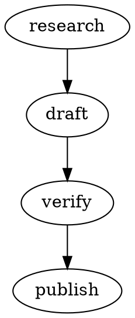

# PRD & Framework Design: Personal Agentic OS
### Combining TANK's Multi-Agent Mission Control with Simon Scrapes' Self-Maintaining Memory OS

**Version:** 2.0  
**Date:** June 2026  
**Purpose:** Build a custom AI agent framework that fuses TANK's self-hosted multi-agent command centre (browser dashboard + Claude Code + git worktrees) with Simon Scrapes' structured memory, skill, and learning architecture.

> **Research basis:**
> - **TANK** — Mike Russell (@CreatorMagicAI): private mission control for Claude Code. Multiple sandboxed agents in isolated git worktrees, Forgejo self-hosted git, browser live dashboard, tmux sessions, SQLite usage tracking. Source: private/paywalled at mrc.fm/premium. Architecture derived from video descriptions and chapter breakdowns.
> - **Simon Scrapes Agentic OS** — Claude Code-based self-maintaining OS: soul.md/user.md/memory.md identity layer, skill chains with SKILL.md, brand_context/, heartbeat self-sync, wrap-up skill, cron scheduling.

---

## 1. Problem Statement

Current AI agent tools solve half the problem:

- **TANK** (Mike Russell / Creator Magic) gives you a self-hosted multi-agent command centre — browser dashboard to watch every Claude Code agent live, each sandboxed in its own git worktree, running on your own server with Forgejo. But TANK is private/paywalled, focused on the orchestration layer, and doesn't include a rich memory, skill, or self-learning system.
- **Simon Scrapes' Agentic OS** gives you deep memory, modular skills, brand context, and self-learning — but it runs as a single Claude Code instance, not as a true multi-agent dashboard, and has no live monitoring or agent isolation.

**The gap:** Nobody has combined a live multi-agent command centre (isolated worktrees, browser dashboard, persistent sessions) with a structured, self-improving memory and skill operating system.

**Result of the gap:** You get either *orchestration* (TANK — watch many agents, run in parallel) or *intelligence* (Agentic OS — deep context, learning, identity) — never both in the same system.

**The additional gaps:**
- **LLM lock-in:** TANK only runs Claude Code. Most frameworks are tied to one model. Not every task needs the most expensive frontier model — a formatting task shouldn't cost the same as architectural reasoning.
- **No project visibility:** There's no way to see what agents are working on, what it's costing, who's assigned to what, or how work is progressing over time. Especially critical in a team context.

**Goal:** Build an open, self-hosted system that combines TANK's multi-agent mission control with Simon Scrapes' Agentic OS brain — model-agnostic across any LLM provider, with built-in project management so every agent is sandboxed, smart, trackable, and cost-optimised.

---

## 2. Vision

A self-hosted AI agent platform that:
- **Runs any LLM** — Claude, GPT-5.5, Gemini, Mistral, local models — via OpenRouter or direct API; swap providers without rebuilding anything
- **Routes tasks to the right model** — simple tasks use cheap/fast models; complex tasks use frontier models; cost drops dramatically
- **Supports any agent runtime** — Claude Code, OpenAI Codex CLI, Google Antigravity, Mammoth pipelines, or any MCP-compatible agent
- **Knows who you are** — persistent identity (soul.md), user preferences, business context
- **Remembers everything** — multi-tier memory that persists and improves across sessions
- **Has modular capabilities** — structured skills that self-register and chain together
- **Runs tasks on autopilot** — scheduled skill chains without human initiation
- **Tracks everything** — task status, costs, resources, timelines, and personnel — lite view always on, full PM layer opt-in
- **Works for teams** — different teams or projects can use different LLMs; costs isolated per team

**Name:** `CommandBrain` (working title) — the command centre (TANK-inspired multi-agent dashboard) fused with the brain (Simon Scrapes Agentic OS memory layer), with a model-agnostic router and built-in project management.

---

## 3. User Stories

| Role | Story | Outcome |
|------|-------|---------|
| User | I message my agent on Telegram at 7am asking for a daily briefing | Agent responds with personalized briefing based on my profile and long-term memory |
| User | I say "wrap up" at end of a work session | Agent reviews session, logs learnings, updates skills, commits to git, re-syncs registry |
| User | I add a new skill folder to the skills/ directory | Agent auto-discovers and registers it on next session start — no manual steps |
| User | I give feedback that the agent's writing tone is too formal | Agent logs this to learnings.md; next session it reads the feedback and adjusts |
| User | I need an agent to monitor my email and a different one to handle customer Telegram messages | Two isolated agents share the gateway but have separate memory and skill contexts |
| User | I want content research to run every Monday at 9am without me doing anything | Cron skill chain triggers the research → draft → review pipeline automatically |
| Developer | I want to swap Claude for GPT-4o without rebuilding everything | Config change in model router; all markdown memory files work as-is |

---

## 4. High-Level Architecture

```
┌───────────────────────────────────────────────────────────────────┐
│              MISSION CONTROL DASHBOARD (Browser)                  │
│          (TANK-inspired — self-hosted web UI on your server)      │
│  Live agent views • Task queue • PM lite view • Cost tracker      │
│  Drag-drop screenshots • LLM query panel • Forge PR review        │
└──────────────┬──────────────────────────────┬─────────────────────┘
               │ Spawn / Monitor              │ Read/Write
               │                         ┌───▼──────────────────────┐
               │                         │   PROJECT MGMT MODULE    │
               │                         │   (SQLite → Postgres)    │
               │                         │   Tasks • Costs          │
               │                         │   Resources • Timelines  │
               │                         │   Personnel • Reports    │
               │                         │   Lite (always on)       │
               │                         │   Full (opt-in)          │
               │                         └──────────────────────────┘
               │
┌──────────────▼────────────────────────────────────────────────────┐
│                MODEL ROUTER (Multi-LLM)                           │
│   Routes each task to the right model + runtime by cost/type      │
│                                                                   │
│  Task Type → Tier → Provider → Runtime                           │
│  ─────────────────────────────────────────────────────────────   │
│  Simple/fast  → Tier 1 (Haiku / Flash / Mistral Small)           │
│  Code/write   → Tier 2 (Sonnet / GPT-5.5 / Mistral Medium 3.5)  │
│  Complex/arch → Tier 3 (Opus / Gemini Pro / GPT-5)              │
│                                                                   │
│  Provider APIs: OpenRouter (315+ models) • Direct API            │
└──────────────┬────────────────────────────────────────────────────┘
               │ Dispatches to correct runtime
               │
┌──────────────▼────────────────────────────────────────────────────┐
│              AGENT RUNTIMES (pluggable)                           │
│  Each agent = tmux session + git worktree + chosen runtime        │
│                                                                   │
│ ┌────────────┐ ┌────────────┐ ┌─────────────┐ ┌──────────────┐ │
│ │ AGENT A    │ │ AGENT B    │ │ AGENT C     │ │ AGENT D      │ │
│ │ Research   │ │ Dev/Code   │ │ Email/Ops   │ │ Pipeline     │ │
│ │            │ │            │ │             │ │              │ │
│ │ Claude     │ │ Codex CLI  │ │ Antigravity │ │ Mammoth DAG  │ │
│ │ Code       │ │ (GPT-5.5)  │ │ (Gemini)    │ │ (any model)  │ │
│ │ worktree-a │ │ worktree-b │ │ worktree-c  │ │ worktree-d   │ │
│ └────────────┘ └────────────┘ └─────────────┘ └──────────────┘ │
└──────────────┬────────────────────────────────────────────────────┘
               │ All runtimes read from shared OS brain
┌──────────────▼────────────────────────────────────────────────────┐
│                  AGENTIC OS BRAIN (Simon Scrapes)                  │
│                                                                    │
│ ┌───────────────┐  ┌─────────────────┐  ┌──────────────────────┐ │
│ │   IDENTITY    │  │    MEMORY       │  │    SKILL SYSTEM      │ │
│ │   soul.md     │  │  memory.md      │  │  skills/ + SKILL.md  │ │
│ │   user.md     │  │  learnings.md   │  │  references/         │ │
│ │               │  │  daily logs     │  │  heartbeat / wrap-up │ │
│ └───────────────┘  └─────────────────┘  └──────────────────────┘ │
│                                                                    │
│ ┌────────────────────────────────────────────────────────────────┐│
│ │   BRAND CONTEXT • HEARTBEAT • SKILL CHAINS • CRON SCHEDULER   ││
│ └────────────────────────────────────────────────────────────────┘│
└──────────────┬─────────────────────────────────────────────────────┘
               │
┌──────────────▼─────────────────────────────────────────────────────┐
│                    INFRASTRUCTURE LAYER                             │
│  Forgejo (self-hosted git) • tmux • SQLite/Postgres                │
│  MCP servers • Supabase/pgvector (optional) • OpenRouter API       │
└────────────────────────────────────────────────────────────────────┘
```

### Team Isolation Model
```
Team A (Marketing) ──→ Claude Code + Claude Sonnet   ──→ Brand/content tasks
Team B (Engineering) ─→ Codex CLI + GPT-5.5          ──→ Code/dev tasks
Team C (Research) ───→ Antigravity + Gemini Pro       ──→ Deep research
Mixed pipelines ─────→ Mammoth DAG (model per node)   ──→ Complex multi-step
```
Each team gets isolated memory context, separate cost tracking, and dedicated Forgejo repos. The Model Router manages all LLM routing transparently.

---

## 5. Component Design (Low-Level)

### 5.1 Mission Control Dashboard (TANK-Inspired)

**What:** A self-hosted browser dashboard that lets you spawn, monitor, and manage multiple Claude Code agents simultaneously  
**Why:** Without a dashboard, you have no visibility into what agents are doing, no way to watch them live, no usage tracking, and no central task queue  
**When:** Runs as a persistent web server (Node.js/Python) on your own server or VPS  
**Where:** Accessible at `http://localhost:3000` (or your VPS IP) — nothing leaves your server except Anthropic API calls  
**How:** Node.js web server + WebSocket for live agent output streaming; spawns and monitors Claude Code processes via child_process/tmux

**Key capabilities (derived from TANK video):**
- **Live agent view** — see every agent's terminal output in real-time in the browser
- **Task queue** — Markdown-based todo list each agent reads and updates
- **Spawn/kill agents** — start a new sandboxed agent for a project with one click
- **Usage tracking** — real-time token/cost tracking per agent stored in SQLite
- **PR management** — agents open pull requests into Forgejo; you merge from dashboard
- **Visual input** — drag and drop screenshots directly into an agent for context
- **LLM query panel** — general-purpose chat mode alongside code agents
- **Self-building** — dashboard can instruct an agent to add a feature to itself (demonstrated live by Mike)

**Infrastructure components:**
```
Dashboard Server (Node.js)
    ↓ spawns
tmux sessions (one per agent, persistent across disconnects)
    ↓ each runs
claude --dangerously-skip-permissions (Claude Code)
    ↓ works in
git worktrees (isolated folder + branch per agent)
    ↓ pushes to
Forgejo (self-hosted git, nothing leaves server)
    ↓ logs to
SQLite (usage tracking database)
```

**Agent configuration:**
```json
{
  "agents": {
    "research-agent": {
      "worktree": "./worktrees/research",
      "branch": "agent/research",
      "tmuxSession": "agent-research",
      "model": "claude-opus-4-8",
      "contextPath": "./context/",
      "permissions": "skip"
    },
    "dev-agent": {
      "worktree": "./worktrees/dev",
      "branch": "agent/dev",
      "tmuxSession": "agent-dev",
      "model": "claude-sonnet-4-6",
      "contextPath": "./context/",
      "permissions": "skip"
    }
  },
  "git": {
    "remote": "http://localhost:3030/your-org/your-repo.git",
    "type": "forgejo"
  },
  "dashboard": {
    "port": 3000,
    "db": "./usage.sqlite"
  }
}
```

**Security note (from Mike):** Every agent runs with `--dangerously-skip-permissions`. This is powerful. Run it isolated, on a dedicated box or VPS, and never as root.

---

### 5.2 Identity Layer

**What:** Persistent files defining who the agent is and who you are  
**Why:** Without identity, every session starts cold — the agent doesn't know your name, preferences, business, or how to behave  
**When:** Read at every session start; updated via wrap-up skill or explicit user commands  
**Where:** `./context/` directory  
**How:** Injected into system prompt at session init

**soul.md** (Agent Identity)
```markdown
# Agent Soul

## Identity
Name: [your agent name]
Role: Personal AI assistant and business operator
Core purpose: Help [user] run [business] efficiently and autonomously

## Behavior
- Always honest, even when the truth is uncomfortable
- Proactive — flags issues before asked
- Concise on small questions, thorough on complex ones
- Takes initiative on repeatable tasks without asking permission each time

## Communication style
[Your preferred tone — formal/casual, verbose/brief, emoji/no emoji]

## Values
[What the agent should always prioritize]

## Hard limits
[What the agent should never do]
```

**user.md** (User Profile)
```markdown
# User Profile

## Who I am
Name: [your name]
Role: [your role/title]
Business: [your business name and what it does]

## How I work
- Best hours: [morning/evening]
- Response preference: [brief bullets / full prose / numbered steps]
- Decision style: [data-driven / gut-feel / collaborative]

## Communication preferences
- Formal or casual: [casual]
- When to interrupt vs. batch questions: [batch unless urgent]

## Technical level
[Beginner / intermediate / advanced — affects how the agent explains things]
```

---

### 5.3 Memory Layer

**What:** Multi-tier persistent memory that survives session ends, reboots, and model switches  
**Why:** Without memory, the agent asks the same questions repeatedly and can't build on past work  
**When:** Read at session start; written to throughout session; consolidated at wrap-up  
**Where:** `./context/memory/` directory  
**How:** Markdown files + optional Supabase vector layer

**Tier 1 — Long-Term Memory** (`memory.md`)
- Business facts that don't change often
- Key decisions and their rationale
- Important people, relationships, project history
- Technical stack and preferences

**Tier 2 — Session Continuity** (`learnings.md`)
- Feedback from last N sessions
- What worked / what didn't
- Skill adjustments needed
- Open questions from previous sessions

**Tier 3 — Daily Logs** (`YYYY-MM-DD.md`)
- Auto-created each day by the wrap-up skill
- What was accomplished
- Decisions made
- Next steps

**Tier 4 — Semantic Memory** (optional, via MemSearch or Supabase + pgvector)
- When memory.md grows large (>5000 tokens) or keyword retrieval starts failing, migrate to vector store
- Hybrid search: semantic vectors + BM25 keyword + RRF reranking (MemSearch pattern)
- Agent queries semantic memory with natural language; returns only relevant context for current task

**Memory injection at session start:**
```
System prompt = soul.md + user.md + recent learnings + relevant memory chunks + current skill registry
```

### Memory Level Selection Guide (Simon Scrapes Framework)

Pick the lowest level that handles your actual workload:

| Level | Architecture | When to Use |
|-------|-------------|-------------|
| 1 | CLAUDE.md + memory.md (native) | Starting out; keep CLAUDE.md under 200 lines |
| 2 | Folder structure + session hooks | After 1 month; multi-project; team use |
| 3 | MemSearch (hybrid vector + BM25) | When retrieval starts failing; 100+ memory chunks |
| 4 | Memory Palace (verbatim RAG) | Legal/research needing exact word-for-word recall |
| 5 | LLM Wiki (Karpathy pattern) | Deep research synthesis — NOT operational memory |
| 6 | Open Brain / Mem0 (cross-tool Postgres) | Using 3+ AI tools daily and memory gaps hurt |

**Recommended starting point for this project:** Level 2 immediately, Level 3 after 90 days.

---

### 5.4 Skill System

**What:** Modular, chainable capability units that the agent can execute  
**Why:** Skills make capabilities repeatable, improvable, and shareable — without skills, every task starts from scratch with no domain knowledge  
**When:** Skills are loaded based on the user's request; the heartbeat keeps registry current  
**Where:** `./skills/` directory  
**How:** Each skill is a folder with SKILL.md + references/

**Skill Structure:**
```
skills/
└── [skill-name]/
    ├── SKILL.md          # Process steps (how to execute)
    ├── SKILL.yaml        # Metadata: name, description, inputs, outputs, dependencies
    └── references/
        ├── brand-voice.md
        ├── examples.md
        └── templates.md
```

**SKILL.md format:**
```markdown
# Skill: [Name]

## Purpose
[One sentence: what this skill does and why]

## Trigger
[Phrases that activate this skill]

## Prerequisites
[What context/files must exist before running]

## Steps
1. Read brand_context/voice-profile.md for tone reference
2. [Step 2]
3. [Step 3]
4. Log outcome to learnings.md

## Output
[What the skill produces and where it saves it]

## Feedback
[How to provide feedback that improves this skill]
```

**Core skills to build (in order):**

| # | Skill | Purpose | Priority |
|---|-------|---------|---------|
| 1 | heartbeat | Self-maintenance scan at session start | Critical |
| 2 | wrap-up | Session close, feedback, git commit | Critical |
| 3 | start-here | Brand context interview + file generation | High |
| 4 | daily-briefing | Morning summary of tasks, memory, schedule | High |
| 5 | memory-update | Manual memory consolidation | High |
| 6 | research | Web research with source logging | Medium |
| 7 | content-draft | Content creation using brand context | Medium |
| 8 | email-draft | Email composition using voice profile | Medium |
| 9 | task-manager | Create/update/review tasks | Medium |
| 10 | code-review | Code review against project standards | Low |

---

### 5.5 Brand Context Layer

**What:** Shared knowledge files that every skill reads from  
**Why:** Without shared context, each skill produces generic output that doesn't sound like you or your business  
**When:** Built once via start-here skill; updated when brand evolves  
**Where:** `./brand_context/`  
**How:** All SKILL.md files include a step to read from brand_context/ before generating output

```
brand_context/
├── voice-profile.md     # Tone: what words you use, what you avoid, formality level
├── positioning.md       # What makes you/your business different
├── icp.md              # Who you serve: demographics, problems, goals
├── samples.md          # 5-10 examples of your best output for each content type
└── assets.md           # Key links, handles, boilerplate disclaimers
```

---

### 5.6 Heartbeat (Self-Maintenance)

**What:** Auto-run scan at every session start that keeps the system current  
**Why:** Without the heartbeat, new skills get forgotten, stale entries cause errors, and the system drifts from reality  
**When:** Fires at session start (triggered by daemon on first message) and optionally on cron  
**Where:** `skills/heartbeat/SKILL.md`  
**How:** Reads file system, diffs against CLAUDE.md registry, updates registry

**Heartbeat execution sequence:**
```
1. Scan skills/ directory → list all SKILL.yaml files
2. Load current registry from CLAUDE.md
3. Diff: find new skills (add), removed skills (delete), changed skills (update)
4. Scan MCP config → detect new servers → add to registry
5. Check cross-skill dependencies → update dependency graph
6. Write updated registry to CLAUDE.md
7. Report: "Heartbeat complete — N skills registered, N removed, N new MCP servers"
```

**CLAUDE.md (auto-maintained registry):**
```markdown
# System Configuration

## Active Skills
- heartbeat: Session self-maintenance
- wrap-up: Session close workflow
- daily-briefing: Morning update
- research: Web research with citation
- content-draft: Brand-aligned content

## MCP Servers
- filesystem: File read/write
- notion: Knowledge base access
- github: Code repository
- gmail: Email access

## Skill Dependencies
- content-draft → requires: brand_context/, research output
- email-draft → requires: brand_context/voice-profile.md

## Last Heartbeat: 2026-06-22 09:14
```

---

### 5.7 Scheduler

**What:** Cron-based system that runs skill chains automatically  
**Why:** The OS should work while you sleep — research, drafts, and reports shouldn't require you to trigger them  
**When:** Set up once; runs on the schedule you define  
**Where:** `./.cron/schedule.json` + daemon cron runner  
**How:** Gateway daemon reads schedule file and fires skill chains at defined times

**schedule.json:**
```json
{
  "schedules": [
    {
      "name": "Morning Briefing",
      "cron": "0 7 * * 1-5",
      "chain": ["daily-briefing"],
      "channel": "telegram",
      "description": "Weekday morning summary"
    },
    {
      "name": "Weekly Research",
      "cron": "0 9 * * 1",
      "chain": ["research", "content-draft"],
      "inputs": { "topic": "industry trends this week" },
      "description": "Monday research into draft pipeline"
    },
    {
      "name": "Memory Consolidation",
      "cron": "0 23 * * *",
      "chain": ["memory-update"],
      "description": "Nightly memory cleanup"
    }
  ]
}
```

---

### 5.8 Multi-Agent Isolation (TANK Pattern)

**What:** Multiple specialized Claude Code agents, each sandboxed in its own git worktree  
**Why:** Without worktree isolation, parallel agents overwrite each other's files. Git worktrees give each agent an isolated working directory and branch — safe to run simultaneously  
**When:** Each agent spawned from the dashboard gets its own worktree + tmux session  
**Where:** `./worktrees/` directory; each worktree is a branch of the same Forgejo repo  
**How:** `git worktree add ./worktrees/agent-name origin/main -b agent/agent-name`

**Agent separation:**
```
project-root/
├── .git/                     # Main git repo
├── worktrees/
│   ├── research/             # Agent A working directory (isolated)
│   ├── dev/                  # Agent B working directory (isolated)
│   └── email/                # Agent C working directory (isolated)
├── context/                  # Shared brain (all agents read this)
│   ├── soul.md
│   ├── user.md
│   ├── memory.md
│   └── learnings.md
├── brand_context/            # Shared brand context (all agents read this)
└── usage.sqlite              # Dashboard tracks all agent usage here
```

**Merge flow:** Agent opens a PR on Forgejo → dashboard shows pending PRs → you review and merge from the browser — same as TANK's workflow.

**Sub-agents:** Claude Code can spawn sub-agents within its own worktree for parallelising deep research (e.g. agent spawns 3 sub-agents to research different topics simultaneously).

---

### 5.9 Model Router (Multi-LLM Layer)

**What:** An intelligent routing layer that selects the right LLM model *and* agent runtime for each task, based on task type, cost tier, and team configuration  
**Why:** Not every task needs the most expensive frontier model. A formatting task at $0.0002/1K tokens shouldn't cost the same as architectural reasoning at $0.015/1K tokens. Routing intelligently can cut LLM costs by 60-80%.  
**When:** Invoked every time an agent is spawned or a task is assigned  
**Where:** `./router/` directory; config in `router.config.json`  
**How:** Rule-based routing with optional LLM-based classifier for ambiguous tasks

**Supported Runtimes:**

| Runtime | Maker | Models | Best For |
|---------|-------|--------|---------|
| **Claude Code** | Anthropic | Claude Haiku/Sonnet/Opus | Default; deep tool use; long-context work |
| **Codex CLI** | OpenAI | GPT-5.5 and prior | Code generation; parallel subagents; computer use |
| **Antigravity CLI** | Google | Gemini 3.5 Flash/Pro | Fast code tasks; multi-agent orchestration |
| **Mistral Vibe CLI** | Mistral | Mistral Medium 3.5 + | Long-running code; remote agents; EU data residency |
| **Mammoth** | 2389 Research | Any (per DAG node) | Complex multi-step pipelines; verification-gated workflows |
| **Direct API** | Any | OpenRouter → 315+ models | Lightweight/cheap tasks via HTTP, no CLI needed |

**Model Tier Matrix:**

| Tier | Cost | Models | Task Types |
|------|------|--------|-----------|
| **Tier 1 — Micro** | <$0.001/1K | Claude Haiku 4.5, Gemini 3.5 Flash, Mistral Small, GPT-4o Mini | Classification, formatting, routing decisions, heartbeat scans |
| **Tier 2 — Standard** | $0.001–0.005/1K | Claude Sonnet 4.6, GPT-5.5, Mistral Medium 3.5, Gemini Pro | Code generation, content writing, research, skill execution |
| **Tier 3 — Frontier** | >$0.005/1K | Claude Opus 4.8, GPT-5, Gemini 3.1 Ultra | Architecture decisions, complex reasoning, multi-document synthesis |
| **Tier 0 — Local** | Free | Ollama (Llama, Phi, Mistral-7B local) | Private/sensitive tasks; offline; development/testing |

**Router Configuration:**
```json
// router/router.config.json
{
  "defaultRuntime": "claude-code",
  "defaultTier": 2,
  "gateway": "openrouter",  // "openrouter" | "direct" | "mixed"
  "openrouterApiKey": "${OPENROUTER_API_KEY}",
  
  "taskRouting": {
    "classification":  { "tier": 1, "model": "claude-haiku-4-5" },
    "formatting":      { "tier": 1, "model": "gemini-3.5-flash" },
    "heartbeat":       { "tier": 1, "model": "claude-haiku-4-5" },
    "code-generation": { "tier": 2, "runtime": "codex-cli", "model": "gpt-5.5" },
    "research":        { "tier": 2, "runtime": "claude-code", "model": "claude-sonnet-4-6" },
    "content-writing": { "tier": 2, "runtime": "claude-code", "model": "claude-sonnet-4-6" },
    "architecture":    { "tier": 3, "model": "claude-opus-4-8" },
    "pipeline":        { "tier": "mixed", "runtime": "mammoth" }
  },
  
  "teams": {
    "marketing": {
      "defaultRuntime": "claude-code",
      "defaultModel": "claude-sonnet-4-6",
      "budgetCap": { "daily": 5.00, "monthly": 100.00 }
    },
    "engineering": {
      "defaultRuntime": "codex-cli",
      "defaultModel": "gpt-5.5",
      "budgetCap": { "daily": 10.00, "monthly": 200.00 }
    },
    "research": {
      "defaultRuntime": "antigravity-cli",
      "defaultModel": "gemini-3.5-flash",
      "budgetCap": { "daily": 8.00, "monthly": 150.00 }
    }
  },

  "fallback": {
    "onBudgetExceeded": "tier-1",
    "onProviderError": "openrouter-backup"
  }
}
```

**OpenRouter Integration (recommended gateway):**
```bash
# Single API key for 315+ models
export OPENROUTER_API_KEY=sk-or-...

# OpenRouter is OpenAI-API compatible — works with any SDK
curl https://openrouter.ai/api/v1/chat/completions \
  -H "Authorization: Bearer $OPENROUTER_API_KEY" \
  -d '{"model": "anthropic/claude-haiku-4-5", "messages": [...]}'
```

**Mammoth Pipeline Example (multi-provider DAG):**


---

### 5.10 Project Management Module

**What:** Task, cost, resource, timeline, and personnel tracking for the whole CommandBrain platform  
**Why:** Without visibility into what agents are doing, what it's costing, and how work is progressing, you can't manage a team or justify the system to stakeholders  
**When:** Lite is always on (zero configuration). Full PM is opt-in via dashboard setting.  
**Where:** PM lite lives in `usage.sqlite`; PM full upgrades to PostgreSQL  
**How:** Two modes — Lite (embedded SQLite, task widget in dashboard) and Full (PostgreSQL, reports, Gantt, personnel)

#### PM Lite (Always On — Zero Config)

Built into the mission control dashboard. No extra setup required. Shows:

```
┌─────────────────────────────────────────────────┐
│  COMMANDBRAIN — TASK VIEW (Lite)                │
│  Today: Mon 22 Jun 2026                         │
├─────────────────────────────────────────────────┤
│ ● Agent A (Research)  In Progress  $0.23 today  │
│   └ Task: Q3 market research — 45 min running   │
│ ● Agent B (Dev)       Idle         $1.12 today  │
│   └ Last: Repo flattener feature — completed    │
│ ○ Agent C (Email)     Pending      $0.00 today  │
│   └ Scheduled: 9am tomorrow                     │
├─────────────────────────────────────────────────┤
│ COSTS TODAY: $1.35  /  MONTH: $24.80            │
│ TASKS: 3 active • 7 completed • 1 scheduled     │
└─────────────────────────────────────────────────┘
```

**SQLite schema (lite):**
```sql
CREATE TABLE tasks (
  id TEXT PRIMARY KEY,
  title TEXT NOT NULL,
  agent_id TEXT,
  team TEXT,
  status TEXT CHECK(status IN ('pending','in_progress','completed','blocked','cancelled')),
  priority INTEGER DEFAULT 2,  -- 1=critical, 2=normal, 3=low
  assigned_to TEXT,            -- person or agent name
  model_used TEXT,
  runtime_used TEXT,
  created_at DATETIME DEFAULT CURRENT_TIMESTAMP,
  started_at DATETIME,
  completed_at DATETIME,
  estimated_minutes INTEGER,
  actual_minutes INTEGER
);

CREATE TABLE costs (
  id INTEGER PRIMARY KEY,
  task_id TEXT REFERENCES tasks(id),
  agent_id TEXT,
  team TEXT,
  model TEXT,
  tokens_in INTEGER,
  tokens_out INTEGER,
  cost_usd REAL,
  timestamp DATETIME DEFAULT CURRENT_TIMESTAMP
);
```

#### PM Full (Opt-In — Enable in Dashboard Settings)

Activates a full project management layer. Upgrades storage to PostgreSQL and unlocks:

**Features:**

| Feature | Description |
|---------|-------------|
| **Project hierarchy** | Workspace → Project → Epic → Task → Subtask |
| **Timeline/Gantt** | Visual timeline of tasks and milestones (HTML/SVG in dashboard) |
| **Resource allocation** | Who (or which agent) is assigned to what; capacity planning |
| **Personnel** | Team member profiles, skills, availability, load |
| **Budget tracking** | Per-project, per-team, per-person budgets with live spend |
| **Cost forecasting** | Extrapolate monthly spend from rolling 7-day average |
| **Burn-down charts** | Sprint/project progress vs. plan |
| **Reports** | Export task lists, cost breakdowns, timelines to CSV/PDF |
| **Notifications** | Alert when budget threshold hit, task blocked, deadline missed |

**Project hierarchy example:**
```
Workspace: MyBusiness
├── Project: Q3 Content Push
│   ├── Epic: Blog series (8 posts)
│   │   ├── Task: Research AI trends  → Agent A (Claude Sonnet)  $0.42
│   │   ├── Task: Write post 1        → Agent B (Mistral Medium) $0.18
│   │   └── Task: Review + publish    → Human: Robin
│   └── Epic: SEO audit
│       └── Task: Keyword analysis   → Agent A (Haiku)          $0.03
└── Project: Platform dev
    ├── Epic: Dashboard v2
    │   └── Task: Build Gantt view   → Agent B (Codex CLI)      $1.20
    └── Epic: Multi-LLM router
        └── Task: Test routing rules → Agent C (Antigravity)    $0.55
```

**Enabling Full PM:**
```bash
# In dashboard settings → Project Management → Enable Full Mode
# This migrates lite SQLite data to Postgres and enables PM features

# Or via CLI:
commandbrain pm upgrade --from=sqlite --to=postgres://localhost:5432/commandbrain
```

**Report types (PM Full):**
```bash
commandbrain report costs --period=month --group-by=team      # Cost by team
commandbrain report costs --period=week  --group-by=model     # Cost by model
commandbrain report tasks --project=q3-content --format=csv   # Task export
commandbrain report timeline --project=platform-dev           # Gantt HTML
commandbrain report forecast --months=3                       # 3-month cost forecast
```

#### Team Mode (Multi-User PM)

When multiple people or teams use CommandBrain:

```
┌─────────────────────────────────────────────────────────────┐
│  TEAM DASHBOARD                                             │
├────────────┬────────────────┬─────────────┬────────────────┤
│ Team       │ Runtime        │ Month Spend │ Active Tasks   │
├────────────┼────────────────┼─────────────┼────────────────┤
│ Marketing  │ Claude Code    │ $87.20      │ 4 in progress  │
│ Engineering│ Codex CLI      │ $142.50     │ 7 in progress  │
│ Research   │ Antigravity    │ $63.10      │ 2 in progress  │
├────────────┼────────────────┼─────────────┼────────────────┤
│ TOTAL      │ Mixed          │ $292.80     │ 13 active      │
└────────────┴────────────────┴─────────────┴────────────────┘
  ⚠ Engineering team: 71% of $200/mo budget used (8 days left)
```

---

## 6. Data Models

### Memory Entry
```typescript
interface MemoryEntry {
  id: string;
  type: 'long-term' | 'session' | 'feedback' | 'decision';
  content: string;
  created: Date;
  lastAccessed: Date;
  tags: string[];
  source: 'user' | 'agent' | 'skill' | 'heartbeat';
  embedding?: number[];  // for vector search (Supabase tier)
}
```

### Skill Manifest
```typescript
interface SkillManifest {
  name: string;
  version: string;
  description: string;
  triggers: string[];
  inputs: { name: string; type: string; required: boolean }[];
  outputs: { name: string; type: string; path: string }[];
  dependencies: string[];
  requiresBrandContext: boolean;
  requiresMemory: boolean;
  schedule?: string;  // cron expression if auto-scheduled
}
```

### Session
```typescript
interface Session {
  id: string;
  agentId: string;
  channel: string;
  userId: string;
  startedAt: Date;
  endedAt?: Date;
  skillsUsed: string[];
  memoryLoaded: string[];  // which memory files were injected
  feedback?: string;
  learnings?: string;      // what got written to learnings.md
}
```

---

## 7. Technical Stack

**Core Platform**

| Component | Technology | Why |
|-----------|-----------|-----|
| **Mission Control Dashboard** | Node.js + WebSocket (custom build) | TANK-inspired — live agent monitoring in browser; self-building |
| **Session Persistence** | tmux | Agents survive disconnects; dashboard streams tmux output |
| **Agent Isolation** | Git worktrees (one per agent) | Each agent writes to its own branch; no conflicts in parallel |
| **Self-Hosted Git** | Forgejo (or Gitea) | Open source GitHub alternative; runs on your server; nothing leaves |
| **OS / Server** | Ubuntu 22.04 LTS on Hetzner CX22 (~€4/mo) | tmux, Forgejo, Node.js all supported; cheap always-on VPS |

**Multi-LLM Layer**

| Component | Technology | Why |
|-----------|-----------|-----|
| **LLM Gateway** | OpenRouter (315+ models, OpenAI-compatible API) | Single API key for every provider; intelligent cost routing; no re-integration per model |
| **Runtime: Default** | Claude Code (`--dangerously-skip-permissions`) | Deep tool use, long context, MCP support |
| **Runtime: Code/Dev** | OpenAI Codex CLI (Rust, GPT-5.5) | Fast parallel subagents, computer use, worktrees built-in |
| **Runtime: Google** | Google Antigravity CLI (Go) | Gemini 3.5 Flash — 4× faster than competitors; multi-agent orchestration |
| **Runtime: Mistral** | Mistral Vibe CLI | Remote agents, EU data residency, Medium 3.5 (128B, 256k ctx) |
| **Runtime: Pipelines** | Mammoth (DOT/DAG executor) | Multi-provider per-node pipelines; verification gates; Bubble Tea TUI |
| **Tier 1 Models** | Claude Haiku 4.5, Gemini 3.5 Flash, Mistral Small | Simple/fast tasks — heartbeat, classification, formatting |
| **Tier 2 Models** | Claude Sonnet 4.6, GPT-5.5, Mistral Medium 3.5 | Standard tasks — code, research, content |
| **Tier 3 Models** | Claude Opus 4.8, GPT-5, Gemini 3.1 Pro | Complex reasoning, architecture, multi-doc synthesis |
| **Tier 0 (Local)** | Ollama (Llama, Phi, Mistral-7B) | Private tasks, offline use, zero cost |
| **Model Router** | Custom Node.js router + `router.config.json` | Rule-based routing by task type; budget caps per team |

**Memory & Intelligence**

| Component | Technology | Why |
|-----------|-----------|-----|
| **Memory (local)** | Markdown files (Level 1–2) | Vendor-agnostic, human-readable, zero infrastructure |
| **Memory (semantic)** | MemSearch / Supabase + pgvector (Level 3) | Hybrid BM25 + vector retrieval; kicks in at 100+ memory chunks |
| **Memory (cross-tool)** | Mem0 or Open Brain / Postgres (Level 6, optional) | Shared memory across Claude, Codex, Antigravity for full teams |
| **Tool Connections** | MCP servers | Official protocol, extensible across all runtimes |
| **Scheduling** | node-cron + shell scripts | Trigger agent sessions and pipelines on cron |

**Project Management**

| Component | Technology | Why |
|-----------|-----------|-----|
| **PM Lite** | SQLite (same DB as usage tracking) | Zero extra setup; always-on task/cost view in dashboard |
| **PM Full** | PostgreSQL + Express REST API | Projects, epics, Gantt, personnel, forecasting, reports (opt-in) |
| **Cost tracking** | SQLite/Postgres + OpenRouter usage API | Per-model, per-agent, per-team real-time spend |
| **Reports** | Node.js CSV/HTML generators | Export tasks, costs, timelines on demand |

### Infrastructure Setup
```bash
# Install Forgejo (self-hosted git)
docker run -d -p 3030:3000 codeberg.org/forgejo/forgejo:latest

# Install tmux (for persistent sessions)
apt install tmux

# Set up git worktrees for each agent
git worktree add ./worktrees/research -b agent/research
git worktree add ./worktrees/dev -b agent/dev

# Run Claude Code in a tmux session (one per agent)
tmux new-session -d -s agent-research
tmux send-keys -t agent-research "cd worktrees/research && claude --dangerously-skip-permissions" Enter

# Install SQLite for usage tracking
apt install sqlite3
```

### MCP Servers to Install
```bash
# File system access
npx @anthropic-ai/mcp-server-filesystem

# Google Drive / Docs
npx @modelcontextprotocol/server-google-drive

# Notion (optional knowledge base)
npx @modelcontextprotocol/server-notion

# Gmail (optional email agent)
npx @modelcontextprotocol/server-gmail
```

---

## 8. Build Phases & Roadmap

### Phase 1: Foundation (Week 1–2)
**Goal:** Single working agent + basic memory layer + git infrastructure

- [ ] Provision a VPS (Hetzner CX22 recommended) or use local machine
- [ ] Install Forgejo (self-hosted git) — docker run on port 3030
- [ ] Install tmux, Claude Code, Node.js 20+
- [ ] Create project repo in Forgejo, clone locally
- [ ] Set up `context/` directory: soul.md, user.md, memory.md, learnings.md
- [ ] Write first soul.md and user.md (who the agent is, who you are)
- [ ] Create `CLAUDE.md` with system prompt that reads context files
- [ ] Start first Claude Code agent in a tmux session, verify it reads memory
- [ ] Run `start-here` interview to build brand_context/
- [ ] Set up git worktrees for 2 agents (research + dev)

**Deliverable:** A Claude Code agent running in tmux that knows your identity, reads memory, and pushes work to Forgejo

---

### Phase 2: Skill System (Week 3–4)
**Goal:** Modular, auto-registering skills

- [ ] Build `heartbeat` skill (scan → diff → update CLAUDE.md)
- [ ] Build `wrap-up` skill (review → feedback → learnings → git commit)
- [ ] Build `daily-briefing` skill (morning summary using memory + schedule)
- [ ] Build `memory-update` skill (manual memory consolidation)
- [ ] Test heartbeat: add a new skill folder, verify it auto-registers
- [ ] Test wrap-up: end session, verify learnings.md updates

**Deliverable:** Self-maintaining skill system that registers and learns without manual intervention

---

### Phase 3: Skill Chains + Scheduling (Week 5–6)
**Goal:** Autonomous operation

- [ ] Build `research` skill (web research + source citation)
- [ ] Build `content-draft` skill (brand-aligned content using brand_context/)
- [ ] Connect skills into a chain: research → content-draft
- [ ] Set up `.cron/schedule.json` with morning briefing
- [ ] Configure daemon cron to fire skill chains
- [ ] Test: Monday morning research chain runs without touching keyboard

**Deliverable:** Agent runs morning briefing and weekly research pipeline autonomously

---

### Phase 4: Multi-LLM Router (Week 7–8)
**Goal:** Model-agnostic routing — right model for each task, costs cut significantly

- [ ] Sign up for OpenRouter; get API key (covers all providers in one)
- [ ] Build `router/router.config.json` with task-type → tier → model mapping
- [ ] Build router script: reads task type from agent metadata → selects model
- [ ] Install Codex CLI (`npm install -g @openai/codex`); set up first Codex agent in worktree
- [ ] Install Antigravity CLI (`brew install google-antigravity` or equivalent); set up Gemini agent
- [ ] Install Mammoth (`go install github.com/2389-research/mammoth/cmd/mammoth@latest`)
- [ ] Write first Mammoth pipeline (research → draft → verify → publish)
- [ ] Test routing: heartbeat task → Haiku; code task → Codex/GPT-5.5; architecture → Opus
- [ ] Verify cost tracking captures model, tokens, cost per task across all runtimes
- [ ] Set budget caps per team in router.config.json

**Deliverable:** Any agent can use any model; model router selects cheapest appropriate tier; Mammoth pipelines run multi-provider workflows

---

### Phase 4.5: Project Management Lite → Full (Week 8–9)
**Goal:** Full task/cost/resource visibility with upgrade path to full PM

- [ ] PM Lite is already live from Phase 1 (SQLite usage tracking). Verify task/cost widget in dashboard.
- [ ] Add task CRUD to dashboard: create, assign, update status, view by agent/team
- [ ] Wire router cost data to PM tables — every agent run logs cost to `costs` table
- [ ] Enable "Full PM" mode in dashboard settings
- [ ] Migrate SQLite → Postgres: `commandbrain pm upgrade`
- [ ] Build Gantt timeline view (HTML SVG in dashboard) for active projects
- [ ] Add personnel table: team members, skills, capacity
- [ ] Build report generator: costs by team/model/week; task completion rate
- [ ] Add budget alerts: webhook/email when team hits 80% of monthly cap
- [ ] Test team isolation: Team A and Team B see only their own tasks + costs

**Deliverable:** Live task/cost dashboard for all agents; full PM unlocked for teams with Gantt, personnel, and reporting

---

### Phase 5: Multi-Agent + Advanced Memory (Week 9–10)
**Goal:** Specialized agents per team + scalable memory

- [ ] Create separate agent contexts per team (isolated soul.md/user.md per team)
- [ ] Set up team-isolated Forgejo repos (Team A repo, Team B repo)
- [ ] Evaluate memory size: if memory.md > 5000 tokens → migrate to MemSearch (Level 3)
- [ ] Install MemSearch plugin for hybrid semantic + BM25 retrieval
- [ ] For cross-tool teams: set up Open Brain or Mem0 for Level 6 shared memory
- [ ] Test multi-agent isolation: verify agents don't bleed memory across teams

**Deliverable:** Multiple specialized teams each with isolated memory, identity, and LLM choices

---

### Phase 6: Production Hardening (Week 11–12)
**Goal:** Reliable, secure, observable system

- [ ] VPS deployment: Ubuntu 22.04, Hetzner CX22, all services as systemd units
- [ ] Forgejo running in Docker with automated backup
- [ ] All agent runtimes (Claude Code, Codex, Antigravity, Mammoth) installed and tested on VPS
- [ ] OpenRouter failover: configure backup provider in router if primary errors
- [ ] Add error handling: if skill or agent fails → log to learnings.md + PM task flagged as blocked
- [ ] Add observability: skill execution logs, session summaries, weekly cost email
- [ ] Automated memory backup: daily git cron push to private Forgejo repo
- [ ] Security: run all agents as non-root user; network isolation between worktrees

**Deliverable:** Production-grade system running 24/7, multi-runtime, multi-LLM, with full project tracking and cost visibility

---

## 9. File System Setup (Step-by-Step)

```bash
# ─── 1. Infrastructure Setup ───────────────────────────────────────────────

# Install Forgejo (self-hosted git) via Docker
docker run -d \
  --name forgejo \
  -p 3030:3000 \
  -v ~/forgejo-data:/data \
  codeberg.org/forgejo/forgejo:latest
# Visit http://localhost:3030 to complete setup, create your org and repo

# Install tmux if not present
apt install tmux  # or: brew install tmux

# ─── 2. Project Scaffold ───────────────────────────────────────────────────

mkdir ~/commandbrain && cd ~/commandbrain

# Core OS brain directories (Simon Scrapes pattern)
mkdir -p context
mkdir -p brand_context
mkdir -p skills/{heartbeat,wrap-up,start-here,daily-briefing,research,content-draft}
mkdir -p skills/{heartbeat,wrap-up,start-here,daily-briefing,research,content-draft}/references
mkdir -p .cron
mkdir -p projects
mkdir -p worktrees  # TANK pattern — one per agent

# Core files
touch context/soul.md
touch context/user.md
touch context/memory.md
touch context/learnings.md
touch CLAUDE.md
touch README.md
touch .cron/schedule.json

# Initialize git and push to Forgejo
git init
git add .
git commit -m "Initial CommandBrain scaffold"
git remote add origin http://localhost:3030/your-org/commandbrain.git
git push -u origin main

# ─── 3. Set Up Agent Worktrees (TANK pattern) ──────────────────────────────

git worktree add ./worktrees/research -b agent/research
git worktree add ./worktrees/dev -b agent/dev
git worktree add ./worktrees/email -b agent/email
# Each worktree shares the same CLAUDE.md and context/ (symlink or copy)

# ─── 4. Start Agents in tmux Sessions ─────────────────────────────────────

# Research agent
tmux new-session -d -s agent-research -c ~/commandbrain/worktrees/research
tmux send-keys -t agent-research "claude --dangerously-skip-permissions" Enter

# Dev agent
tmux new-session -d -s agent-dev -c ~/commandbrain/worktrees/dev
tmux send-keys -t agent-dev "claude --dangerously-skip-permissions" Enter

# ─── 5. Usage Tracking Database ────────────────────────────────────────────

sqlite3 ~/commandbrain/usage.sqlite "
CREATE TABLE IF NOT EXISTS usage (
  id INTEGER PRIMARY KEY,
  agent_name TEXT,
  session_id TEXT,
  tokens_in INTEGER,
  tokens_out INTEGER,
  model TEXT,
  cost_usd REAL,
  timestamp DATETIME DEFAULT CURRENT_TIMESTAMP
);"

# ─── 6. Multi-LLM Runtime Setup ────────────────────────────────────────────

# OpenRouter (universal LLM gateway — do this first)
export OPENROUTER_API_KEY=sk-or-...   # Add to .env file
echo "OPENROUTER_API_KEY=sk-or-..." >> ~/commandbrain/.env

# Claude Code (already installed if you're here)
# claude --dangerously-skip-permissions

# OpenAI Codex CLI
npm install -g @openai/codex
export OPENAI_API_KEY=sk-...

# Google Antigravity CLI
# Download from: https://developers.google.com/antigravity/cli
# Or: curl -fsSL https://antigravity.google.dev/install.sh | bash
export GOOGLE_API_KEY=...

# Mistral Vibe CLI
# Download from: https://vibe.mistral.ai/cli
export MISTRAL_API_KEY=...

# Mammoth (pipeline executor)
go install github.com/2389-research/mammoth/cmd/mammoth@latest
# Or: grab binary from https://github.com/2389-research/mammoth/releases

# ─── 7. Mission Control Dashboard (build) ──────────────────────────────────

mkdir ~/commandbrain/dashboard
cd ~/commandbrain/dashboard
npm init -y
npm install express ws node-pty better-sqlite3 node-cron
# Build your dashboard server (see Section 5.1 spec)

# ─── 8. Project Management DB Init ─────────────────────────────────────────

# PM Lite (SQLite — already exists from usage tracking step above)
# Extend with task table:
sqlite3 ~/commandbrain/usage.sqlite "
CREATE TABLE IF NOT EXISTS tasks (
  id TEXT PRIMARY KEY,
  title TEXT NOT NULL,
  agent_id TEXT, team TEXT,
  status TEXT DEFAULT 'pending',
  priority INTEGER DEFAULT 2,
  assigned_to TEXT, model_used TEXT, runtime_used TEXT,
  created_at DATETIME DEFAULT CURRENT_TIMESTAMP,
  started_at DATETIME, completed_at DATETIME,
  estimated_minutes INTEGER, actual_minutes INTEGER
);"

# PM Full (when ready — migrate to Postgres):
# commandbrain pm upgrade --from=sqlite --to=postgres://localhost:5432/commandbrain
```

---

## 10. CLAUDE.md Template (System Prompt)

```markdown
# CommandBrain System Configuration

## Identity
You are [Agent Name], a personal AI agent for [User Name].

Read these files at the start of every session:
- context/soul.md — your identity and behavior rules
- context/user.md — who you're working with and their preferences
- context/memory.md — long-term business knowledge
- context/learnings.md — recent feedback and improvements

## Skill Registry
<!-- Heartbeat maintains this automatically — do not edit manually -->
- heartbeat: Run at session start; scan and sync skill registry
- wrap-up: Run at session end ("close" or "wrap up")
- start-here: Build or update brand context
- daily-briefing: Morning summary
- research: Web research with citations
- content-draft: Brand-aligned content creation

## MCP Servers
<!-- Heartbeat detects and registers these automatically -->
- filesystem: Read/write local files
- github: Version control

## Rules
1. Always run heartbeat at session start
2. Always run wrap-up when user says "close" or "wrap up"
3. Log all session learnings to context/learnings.md before ending
4. Never modify soul.md without explicit user permission
5. When uncertain about brand voice, read brand_context/samples.md before writing

## Last Heartbeat
<!-- Updated automatically -->
```

---

## 11. Success Metrics

| Metric | Target | How to Measure |
|--------|--------|----------------|
| Agent uptime | >99% | Gateway daemon health check |
| Memory persistence | 100% across sessions | Spot-check: ask agent what it remembers from 7 days ago |
| Skill auto-registration | 100% of new skill folders | Add test skill, verify CLAUDE.md updates within 60 seconds |
| Learnings loop | Skills improve measurably | Before/after output quality rating over 30 days |
| Autonomous task completion | >80% without human intervention | Log scheduled tasks: completed vs. failed |
| Model switch time | <5 minutes | Change model in config, verify same memory/behavior |

---

## 12. Key Design Decisions & Rationale

### Why OpenRouter as the LLM Gateway?
- One API key for every provider — Anthropic, OpenAI, Google, Mistral, Meta, xAI, 60+ more
- OpenAI-compatible interface — any SDK works; no re-integration when you add a new provider
- Intelligent routing built-in: you set `max_price` and it finds cheapest provider for the model
- Real-time cost data per request — pipe straight into PM cost tables
- Fallback: if Anthropic API is down, OpenRouter retries other providers automatically
- Proven: organisations report 60% API cost reductions using tier-based routing through OpenRouter

### Why Multiple Agent Runtimes?
- **Claude Code** is best for tool use, MCP, and memory-heavy tasks — it reads CLAUDE.md natively
- **Codex CLI** (GPT-5.5) is best for parallel code tasks and computer use workflows
- **Antigravity CLI** (Gemini 3.5 Flash) is 4× faster than competitors on pure coding benchmarks — use it for speed-critical or Google-ecosystem tasks
- **Mistral Vibe** offers EU data residency and remote agent execution — important for regulated industries
- **Mammoth** is the only runtime that runs a multi-provider DAG pipeline — different models at different nodes, with verification gates between them
- Not every task needs the same runtime. Forcing everything through Claude Code is like using a sledgehammer for everything.

### Why PM Lite Always On, Full Opt-In?
- Lite adds zero overhead — it's just extra tables in the existing SQLite usage DB
- The task widget in the dashboard (like Flint) gives immediate value with no configuration
- Full PM (Postgres, Gantt, personnel) is real engineering — only turn it on when you actually need team-scale visibility
- Starting with Lite means you already have data history when you upgrade to Full

### Why TANK-Inspired Architecture Instead of Off-the-Shelf?
- TANK is private/paywalled — but its architecture is clear from Mike's demos: git worktrees + tmux + Forgejo + browser dashboard
- Building your own means: complete ownership, no subscription lock-in, customisable to your exact workflow
- Forgejo is MIT licensed and runs in Docker — self-hosted in minutes
- tmux gives persistent sessions with zero overhead
- The dashboard builds itself (Claude Code can add features to the dashboard while running inside it)

### Why Markdown for Memory?
- **Vendor-agnostic:** Switch from Claude to GPT-4o or Gemini — same files work
- **Human-readable:** You can read, edit, and version control your own memory
- **LLM-native:** Markdown is what LLMs read best
- **Zero infrastructure:** No database to maintain for Phase 1-3

### Why skill/ as Folder-Based, Not Code-Based?
- Skills are prompts + knowledge, not code — folders are the right abstraction
- Anyone (non-developer) can add a skill by creating a folder
- Heartbeat auto-discovers them — no deployment step
- Skills can be shared on GitHub as a simple zip/folder

### Why Git for Everything?
- Memory is now version-controlled — roll back to yesterday's memory if agent goes wrong
- Skills are version-controlled — see exactly what changed in each skill over time
- Enables team collaboration (pull requests on skills and memory)

### Why Separate soul.md from user.md?
- **soul.md** shouldn't change often — it's the agent's stable identity
- **user.md** changes as your preferences evolve — separating them prevents identity drift
- Conceptually clean: the agent has its own character, and it also knows about you

---

## Appendix A: TANK vs. Simon Scrapes — What Each Contributes

| Capability | Source | Component |
|------------|--------|-----------|
| Multi-agent orchestration | TANK (Mike Russell) | One Claude Code instance per agent |
| Agent isolation | TANK | Git worktrees — one per agent, separate branch |
| Live browser monitoring | TANK | Dashboard — watch agents work in real-time |
| Self-hosted git | TANK | Forgejo (open source GitHub alternative) |
| Persistent sessions | TANK | tmux — agents survive disconnects |
| Usage tracking | TANK | SQLite — token/cost per agent per session |
| Visual input to agents | TANK | Drag-and-drop screenshots into Claude Code |
| Self-building dashboard | TANK | Agents add features to the dashboard itself |
| PR-based merge flow | TANK | Agents open PRs on Forgejo, you review + merge |
| Sub-agent spawning | TANK / Claude Code | Claude Code native sub-agents for deep research |
| Agent identity | Simon Scrapes | soul.md |
| User preferences | Simon Scrapes | user.md |
| Long-term memory | Simon Scrapes | memory.md |
| Learning loop | Simon Scrapes | learnings.md + wrap-up skill |
| Brand voice | Simon Scrapes | brand_context/ |
| Modular skills | Simon Scrapes | skills/ folder + SKILL.md |
| Self-maintenance | Simon Scrapes | heartbeat skill |
| Session close | Simon Scrapes | wrap-up skill |
| Skill chaining | Simon Scrapes | Sequential skill execution |
| Scheduled automation | Simon Scrapes | .cron/schedule.json + shell scripts |
| Semantic memory (opt.) | Community | Mem0 / Supabase + pgvector |

---

## Appendix B: Resources

### TANK (Mike Russell / Creator Magic)
- [YouTube: My Exact Claude Code Setup Still Allowed After Ban](https://youtu.be/hXWwqPgexZU) — Primary TANK demo
- [YouTube: Claude Fable 5 Runs My Entire Life](https://youtu.be/mhqAHxvareo) — TANK in action
- [Creator Magic Community](https://mrc.fm/cmc) — Where to join (160+ builders)
- [Creator Magic Premium](https://mrc.fm/premium) — TANK source (code: TANK for discount)
- [Forgejo](https://forgejo.org/) — Self-hosted git (open source, Docker-ready)

### Multi-LLM Runtimes & Providers
- [OpenRouter](https://openrouter.ai/) — Unified API for 315+ models; cost-optimised routing; provider fallback
- [OpenRouter Pricing](https://openrouter.ai/models) — Compare model costs side-by-side
- [OpenAI Codex CLI](https://github.com/openai/codex) — Open source, Rust, GPT-5.5; parallel subagents; computer use
- [OpenAI Codex Docs](https://developers.openai.com/codex/cli) — CLI reference, subagents, worktrees
- [Google Antigravity](https://developers.googleblog.com/build-with-google-antigravity-our-new-agentic-development-platform/) — Google's agentic dev platform (SDK + CLI + Desktop)
- [Antigravity 2.0 Launch](https://thenextweb.com/news/google-antigravity-2-desktop-cli-sdk-io-2026) — What's new at I/O 2026
- [Mistral Vibe](https://mistral.ai/products/vibe/) — Formerly Le Chat; remote agents; CLI; Medium 3.5 (128B, 256k ctx)
- [Mistral Agents API](https://mistral.ai/news/agents-api/) — Building agentic workflows with Mistral
- [Mammoth by 2389 Research](https://2389.ai/products/mammoth/) — DAG pipeline executor, multi-provider, TUI
- [Mammoth GitHub](https://github.com/2389-research/mammoth) — Install + DOT file reference
- [Ollama](https://ollama.ai/) — Local model runner (Llama, Phi, Mistral-7B); Tier 0 free models

### Project Management
- [SQLite](https://sqlite.org/) — PM Lite database (zero-config, embedded)
- [PostgreSQL](https://postgresql.org/) — PM Full database (team-scale, Gantt, reporting)
- [Supabase](https://supabase.com/) — Managed Postgres + pgvector for team memory + PM Full

### Simon Scrapes Agentic OS
- [YouTube: @simonscrapes](https://www.youtube.com/@simonscrapes)
- [Marketing Agent Blog: Agentic OS Tutorial](https://marketingagent.blog/2026/03/16/tutorial-build-an-agentic-os-with-claude-code-skills/)
- [Claude Auto-Memory / Dream Feature](https://claudefa.st/blog/guide/mechanics/auto-dream)

### MCP & Claude Code
- [MCP Documentation](https://modelcontextprotocol.io/)
- [Claude Code Docs](https://docs.anthropic.com/claude-code)
- [Anthropic Pricing](https://claude.ai) — Max plan recommended for high-cadence skill chains

### Memory & Tooling
- [Mem0 (semantic memory)](https://mem0.ai)
- [Supabase (vector memory)](https://supabase.com)
- [Hetzner VPS (for always-on hosting)](https://hetzner.com)
